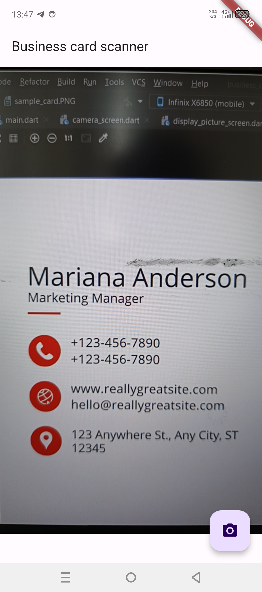
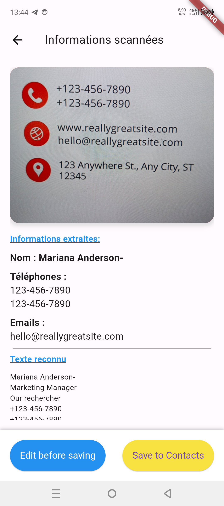
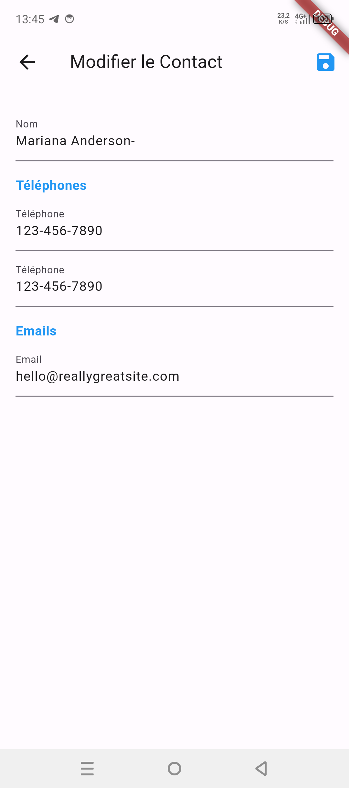

# Flutter Business Card Scanner

Bienvenue dans l'application **Flutter Business Card Scanner**. Cette application mobile permet de scanner des cartes de visite, d'extraire les informations importantes telles que le nom, les numéros de téléphone et les adresses e-mail, et de les enregistrer directement dans la liste de contacts de votre téléphone. Elle utilise Google ML Kit pour la reconnaissance de texte.

## Sommaire

1. [Fonctionnalités](#fonctionnalités)
2. [Captures d'écran](#captures-décran)
3. [Installation](#installation)
4. [Utilisation](#utilisation)
5. [Tests](#tests)
6. [Contribuer](#contribuer)
7. [Licence](#licence)

## Fonctionnalités

- **Scan de cartes de visite** : Utilisez la caméra de votre téléphone pour capturer une image de la carte de visite. L'application reconnaît automatiquement le texte présent sur la carte.
- **Extraction des informations** : L'application extrait les informations pertinentes telles que le nom, les numéros de téléphone et les adresses e-mail à partir du texte scanné.
- **Édition des informations** : Avant d'enregistrer les informations extraites, vous avez la possibilité de les modifier pour corriger toute erreur ou ajouter des détails supplémentaires.
- **Enregistrement dans les contacts** : Enregistrez directement les informations extraites et modifiées dans la liste de contacts de votre téléphone en appuyant sur un bouton.

## Captures d'écran

### Interface principale

L'interface principale de l'application vous permet de prendre une photo d'une carte de visite.



### Scanning de la carte

Une fois que la photo est prise, l'application extrait le texte de la carte.



### Édition des informations extraites

Avant d'enregistrer les informations, vous pouvez les modifier pour vous assurer qu'elles sont correctes.



## Installation

### Prérequis

Assurez-vous d'avoir installé Flutter et d'avoir configuré un environnement de développement approprié pour Flutter. Vous pouvez suivre les instructions [ici](https://flutter.dev/docs/get-started/install).

### Étapes d'installation

1. **Clonez le dépôt GitHub** :

   ```bash
   git clone https://github.com/Alwil17/business_card_scanner.git
   cd business_card_scanner
   ```

2. **Installez les dépendances** :

   Naviguez dans le dossier du projet et installez les dépendances nécessaires en utilisant la commande suivante :

   ```bash
   flutter pub get
   ```

3. **Lancez l'application** :

   Connectez un appareil Android ou iOS, ou lancez un émulateur, puis exécutez l'application avec la commande :

   ```bash
   flutter run
   ```

   Si vous souhaitez exécuter l'application sur un émulateur spécifique, vous pouvez lister les dispositifs disponibles avec `flutter devices` et spécifier l'ID du dispositif :

   ```bash
   flutter run -d <device-id>
   ```

## Utilisation

### Prendre une photo d'une carte de visite

1. Lancez l'application sur votre appareil.
2. Dirigez la caméra vers la carte de visite et capturez une image claire de celle-ci.
3. L'application analysera automatiquement l'image et extraira les informations textuelles.

### Modifier les informations extraites

1. Après l'extraction, vous serez redirigé vers une page contenant un formulaire pré-rempli avec les informations extraites.
2. Vous pouvez modifier le nom, les numéros de téléphone, et les adresses e-mail avant de les enregistrer.
3. Appuyez sur le bouton "Save to Contacts" pour enregistrer les informations modifiées dans votre liste de contacts.

### Enregistrer les informations dans les contacts

L'application vous permet d'enregistrer directement les informations extraites et modifiées dans les contacts de votre appareil. Les informations sont enregistrées dans le format correct pour être facilement retrouvées et utilisées.

## Tests

Pour tester l'application, vous pouvez utiliser les images fournies ou vos propres cartes de visite.

### Images de test

Voici quelques exemples d'images de cartes de visite que vous pouvez utiliser pour tester l'application :

- 

### Scénarios de test

1. **Test de reconnaissance de texte** :
   - Prenez une photo d'une carte de visite contenant différents types de texte (noms, numéros, e-mails).
   - Vérifiez que les informations sont correctement extraites.
   
2. **Test de modification** :
   - Modifiez les informations extraites.
   - Enregistrez-les dans les contacts.
   - Vérifiez que les informations sont enregistrées correctement avec les modifications appliquées.

3. **Test d'enregistrement des contacts** :
   - Enregistrez plusieurs cartes de visite et vérifiez leur présence dans l'application de contacts de votre appareil.

## Contribuer

Les contributions sont les bienvenues ! Si vous souhaitez ajouter de nouvelles fonctionnalités, corriger des bugs ou améliorer l'application de toute autre manière, veuillez suivre ces étapes :

1. **Forkez** le projet.
2. **Créez** une branche pour votre fonctionnalité (`git checkout -b feature/AmazingFeature`).
3. **Committez** vos modifications (`git commit -m 'Add some AmazingFeature'`).
4. **Poussez** vers la branche (`git push origin feature/AmazingFeature`).
5. **Ouvrez** une Pull Request.

N'oubliez pas de mettre à jour les tests en conséquence.

## Licence

Ce projet est sous licence MIT - voir le fichier [LICENSE](LICENSE) pour plus de détails.
